# Smart24x7 Women's Safety App

## Overview

Smart24x7 Women's Safety App is a mobile application designed to provide women with a sense of security and quick access to assistance in times of distress. The app offers various features tailored to enhance the safety of women, including emergency triggers, helpline calls, contact management, and more. Developed for Android devices, this app aims to empower women by providing them with a reliable tool for emergency situations.

## Features

### Emergency Trigger

- Empowers users to trigger an emergency alert by shaking their device.
- Upon activation, the app sends an SMS containing the user's location details to designated emergency contacts.

### Helpline Call

- Offers direct access to emergency helpline numbers such as police, ambulance, and distress helpline.
- Allows users to make emergency calls to selected helpline numbers directly from within the app.

### User Registration

- Enables new users to register by providing essential details such as full name, email, password, and phone number.
- Registration data is securely stored in the Firebase Firestore database for user authentication and profile management.

### Contact Management

- Facilitates users in adding and managing family and friends' phone numbers in the app's contact list.
- These contacts are promptly notified via SMS in case of an emergency trigger initiated by the user.

### View Contacts

- Provides users with a comprehensive view of the contacts added to the app, ensuring quick access to critical contacts.

### User Profile

- Allows users to view and edit their profile details, including full name, email, and phone number.
- Profile information is seamlessly integrated from the Firebase Firestore database, ensuring up-to-date user data.

### Splash Screen

- Introduces users to the app's features and functionality.
- Requests necessary permissions, such as location and SMS, to ensure the smooth operation of the app.

### Database Integration

- Utilizes SQLite database for local storage and management of contact details.
- Firebase Firestore database is employed for user authentication, profile management, and data synchronization.

### Responsive UI

- Delivers a user-friendly interface with intuitive navigation tailored to meet the needs of women users.
- Supports various screen sizes and orientations for enhanced accessibility.

## Screenshots

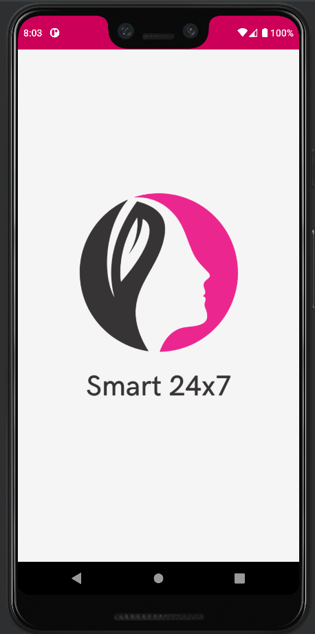
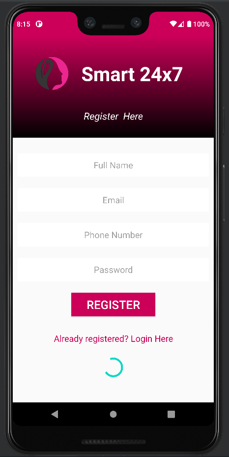
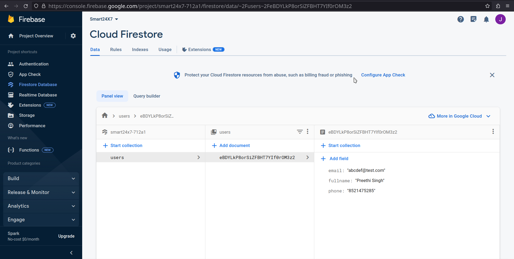
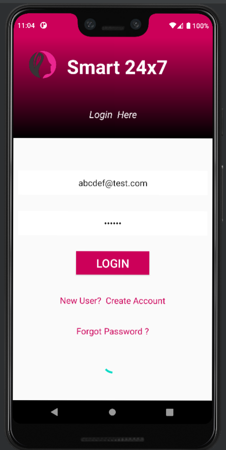
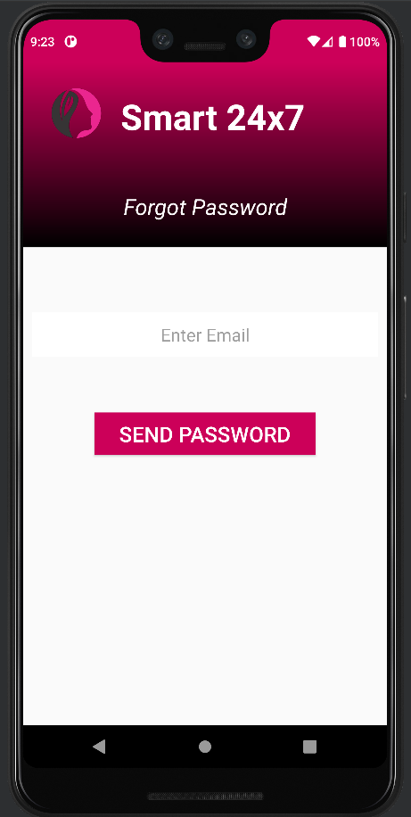
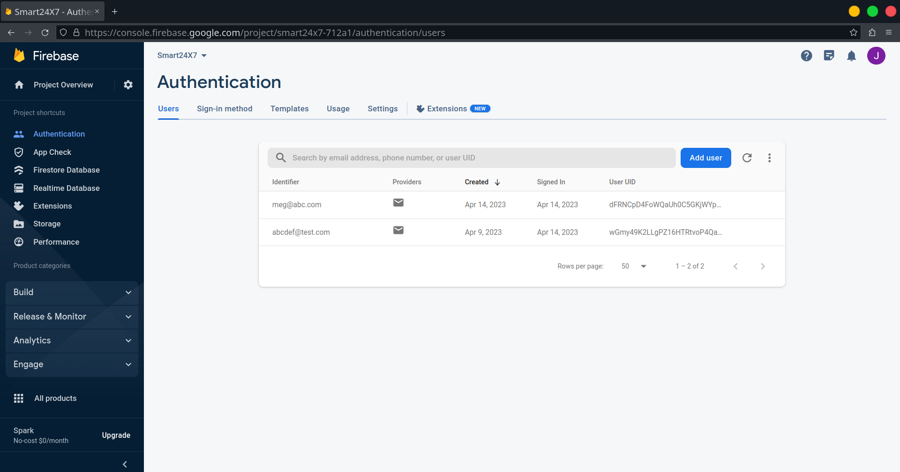
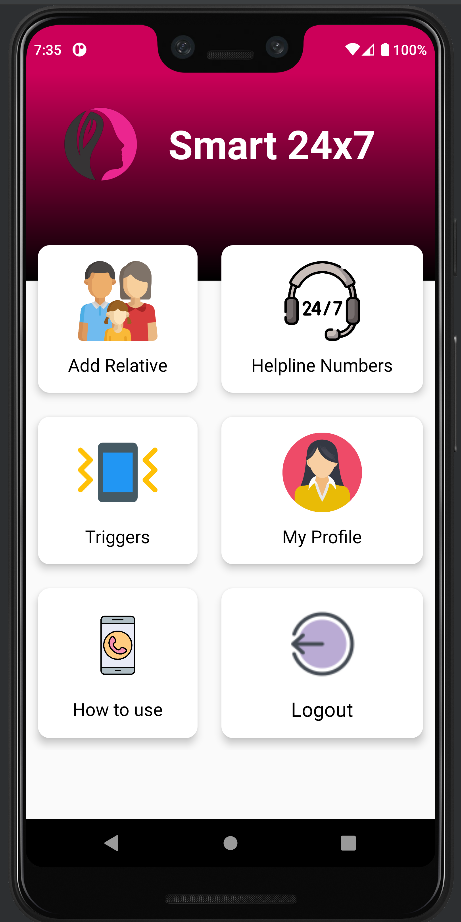
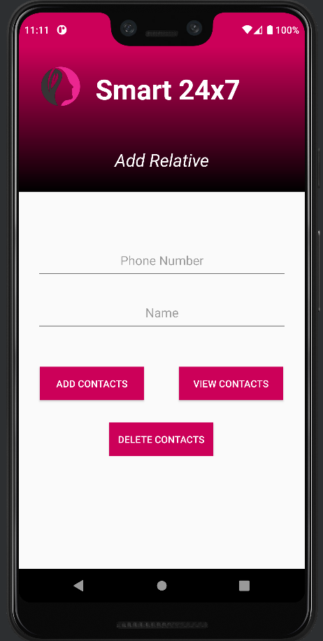
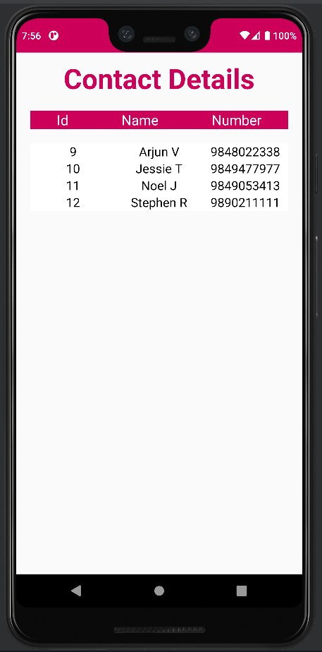
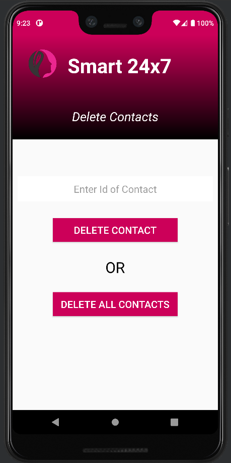
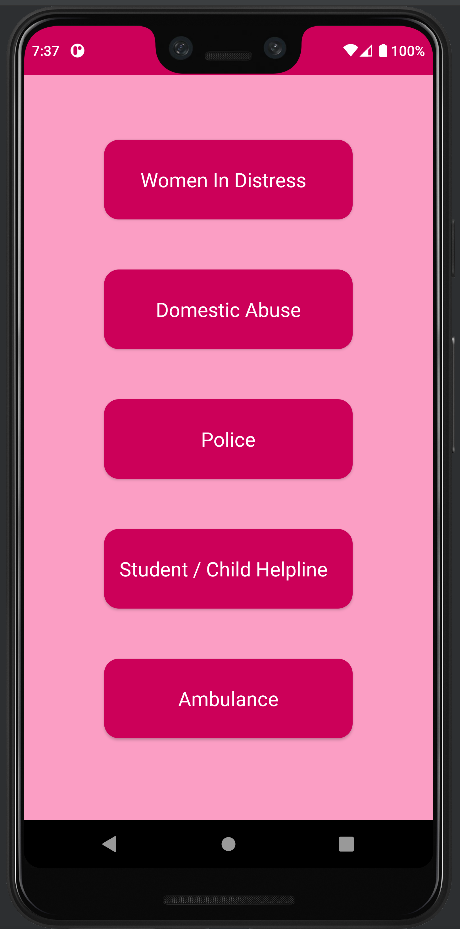
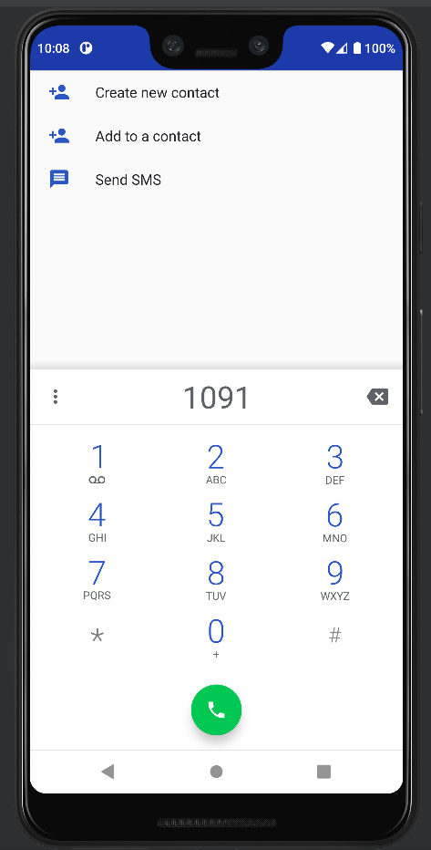
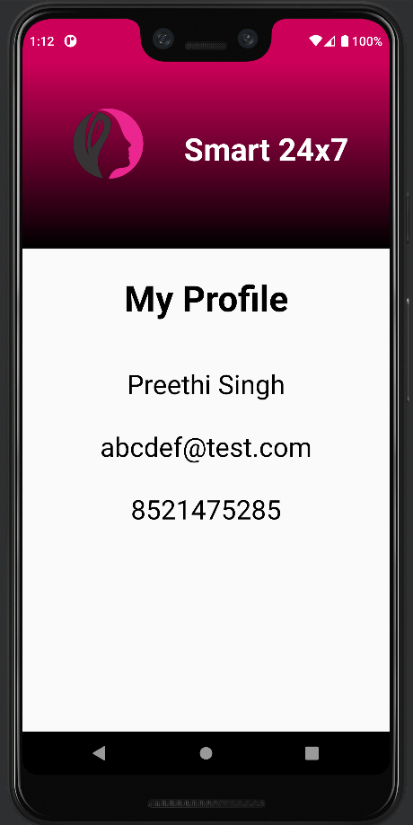
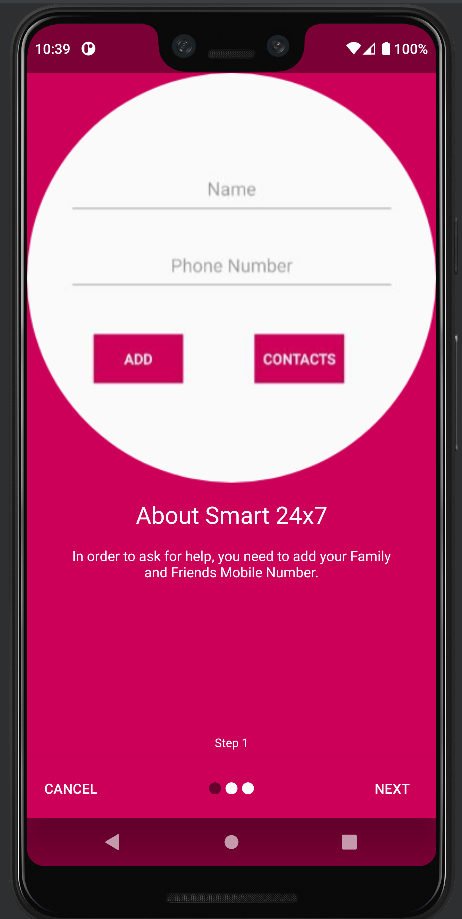
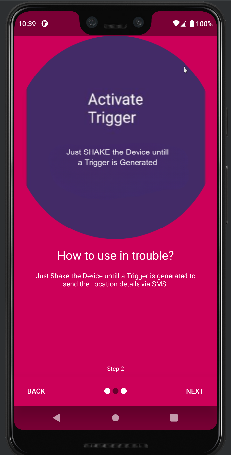
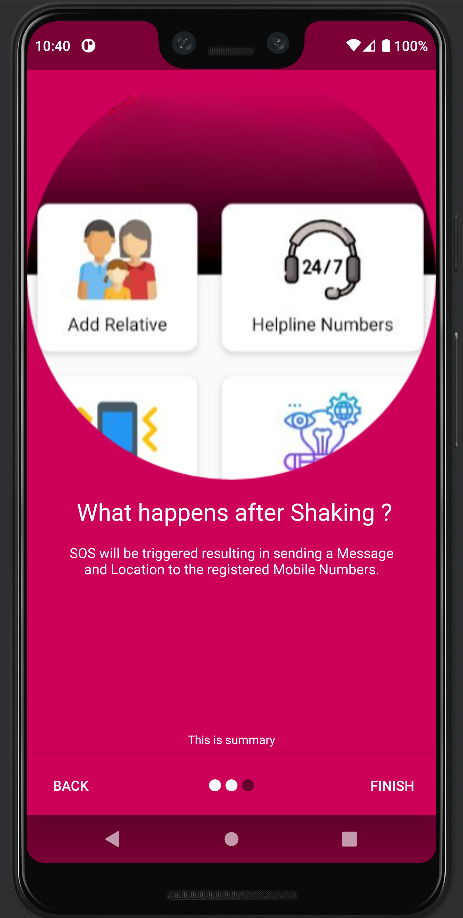

## Requirements

- Android device running Android 5.0 (Lollipop) or higher.
- Internet connection for Firebase authentication and data synchronization.

## Installation

- Download the APK file from the provided link.
- Enable installation from unknown sources in your device settings.
- Open the APK file and follow the on-screen instructions to install the app.

## Usage

- Launch the app after installation.
- Register a new account or log in with an existing account.
- Add emergency contacts to the app.
- Use the shake gesture or helpline call feature in case of emergencies.

## Contributors

- Ganesh Ch
- Meghana S
- Parimala G

## License

This project is licensed under the MIT License.
